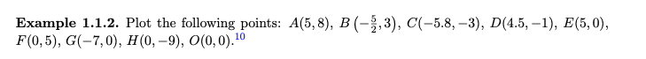
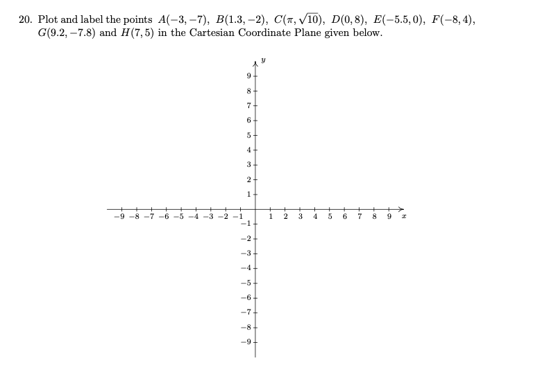
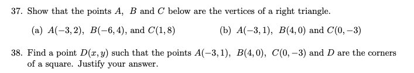

# Part I

Plot the following points in [Desmos Graphic Calculator](https://www.desmos.com/calculator)

  

Send the SCREENSHOT

# Part II

Plot the following points on a paper
  
  

# Part III - Optional
Optional Task Has No Deadline, But You May Do Them Before Next Friday (July 10)  
  
